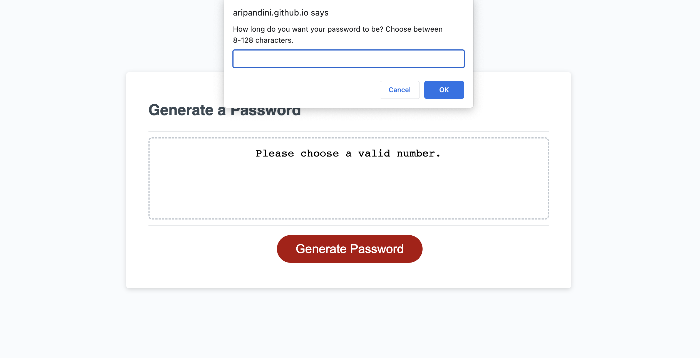

# Module 3 Challenge

## Description

Generating a random password based on specific criteria using JavaScript. 

## Deployed Application

[Deployed Application on Github](https://aripandini.github.io/module-3-challenge/)

## Screenshot 

